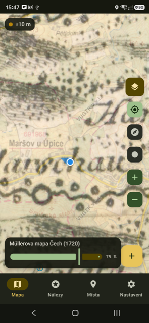
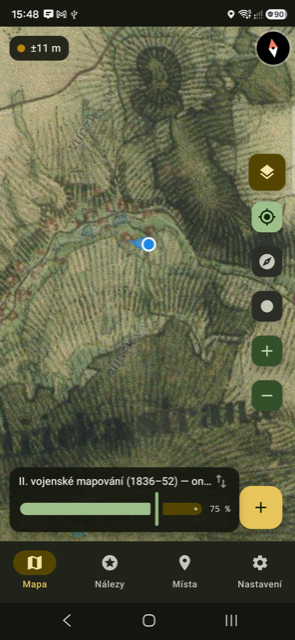
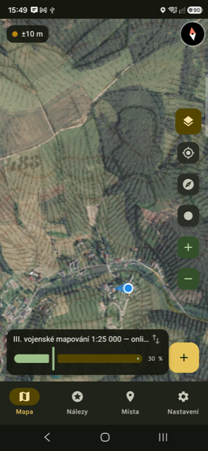
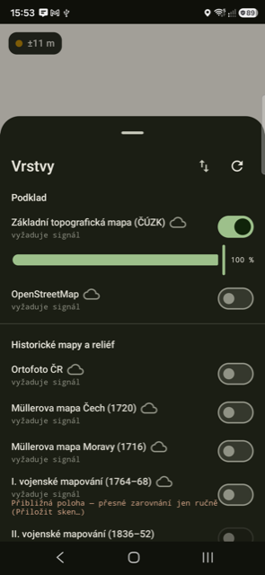
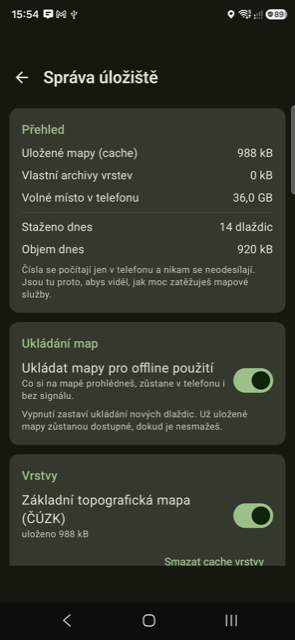

<div align="center">

# DetektorMapy

### Staré mapy nad tvojí polohou. Přímo v poli.

Vytáhneš telefon a pod modrou tečkou uvidíš krajinu roku 1720, 1840 nebo 1880.
Zaniklou cestu. Mlýn. Samotu. Hráz rybníka, který dneska není.

**Zadarmo · bez reklam · bez účtu · funguje bez signálu**

[**⬇️ Stáhnout aplikaci**](../../releases/latest) · [Jak ji nainstalovat](#jak-ji-nainstalovat-za-dvě-minuty) · [Co zatím neumí](#co-zatím-neumí)

</div>

---

## Co uvidíš

<table>
<tr>
<td width="33%"></td>
<td width="33%"></td>
<td width="33%"></td>
</tr>
<tr>
<td align="center"><b>Müller 1720</b><br>přes dnešní mapu</td>
<td align="center"><b>II. vojenské mapování</b><br>1836–52, celá ČR</td>
<td align="center"><b>Prolnutí s ortofotem</b><br>posuvníkem na mapě</td>
</tr>
</table>

## Co umí

🗺️ **Všechny velké historické mapy Česka.** Müllerova mapa Čech (1720) a Moravy
(1716), I., II. i III. vojenské mapování, císařské otisky stabilního katastru,
ortofoto a topografická mapa ČÚZK. Celá republika, žádné stahování dopředu.

📴 **Co jsi jednou viděl, máš navždy.** Každá dlaždice, kterou si prohlédneš, zůstane
v telefonu. V lese bez signálu mapa jede dál. Automaticky, nemusíš nic řešit.

🎚️ **Průhlednost jedním prstem.** Posuvník rovnou na mapě, ne schovaný v menu.
Podržíš tlačítko vrstev a na okamžik mrkneš, co je pod starou mapou.

🎯 **Srovnáš posunutou mapu prstem.** Staré mapy nikdy neseděly. Táhneš starou mapu,
až rybník sedne na rybník — a je to uložené pro tuhle oblast. Kdo chce přesně, má
editor vlícovacích bodů.

⛰️ **LiDAR reliéf.** Stínovaný model terénu z leteckého laseru ukáže úvozy, meze,
terasy i základy staveb — pod korunami stromů, kde na ortofotu nevidíš nic.

📓 **Deník nálezů.** Foto, GPS, kategorie, hloubka. Waypointy, prohledané zóny,
záznam pochůzky do GPX. Kdykoliv vyexportuješ.

🛡️ **Ukazuje ÚAN.** Území s archeologickými nálezy máš na mapě, ať víš, kde nemáš
co dělat.

🔒 **Nic se nikam neposílá.** Žádný účet, žádná registrace, žádná analytika. Nálezy,
trasy i poloha zůstávají v telefonu. Ven jdou jen dotazy na dlaždice a na počasí.

<table>
<tr>
<td width="50%"></td>
<td width="50%"></td>
</tr>
<tr>
<td align="center"><b>Zapneš, co chceš vidět</b></td>
<td align="center"><b>Vidíš, kolik místa mapy zabírají</b></td>
</tr>
</table>

---

## Jak ji nainstalovat (za dvě minuty)

Aplikace **není v Google Play**, nainstaluješ ji ze souboru. Zní to hůř, než to je.

**1.** V telefonu otevři [**stránku ke stažení**](../../releases/latest) a klepni na
soubor končící `.apk`.

**2.** Telefon se zeptá, jestli to má stáhnout → **Stáhnout**.

**3.** Otevři stažený soubor — z lišty oznámení, nebo *Soubory* → *Stažené*.

**4.** Android řekne, že z tohohle zdroje instalovat nesmí. Klepni na **Nastavení**,
zapni **Povolit z tohoto zdroje** a vrať se zpátky.

**5.** **Instalovat** → **Otevřít**.

**6.** Povol **přístup k poloze** — bez toho neuvidíš, kde stojíš.

**7.** Klepni na 🗂 vpravo nahoře a zapni si historickou mapu.
Začni **II. vojenským mapováním**, je nejvýraznější.

Hotovo.

> **Aplikace se sama neaktualizuje.** Není v žádném obchodě, takže o nové verzi se
> nedozvíš a nepřijde ti sama. **Každou novou verzi si musíš stáhnout a nainstalovat
> ručně**, přesně stejným postupem jako tuhle první — data, nálezy ani stažené mapy
> o nic nepřijdou.
>
> V aplikaci najdeš v **Nastavení → Verze** tlačítko *Zkontrolovat aktualizaci*, které
> se podívá, jestli tu není něco novějšího, a pošle tě rovnou na stránku s changelogem.
> Kdo to nechce řešit vůbec, přidá si repozitář do
> [Obtainium](https://github.com/ImranR98/Obtainium) a aktualizace chodí samy.

> **Google Play Protect** může u ručně instalované aplikace hlásit varování. To je
> standardní hláška u všeho mimo obchod, ne nález něčeho škodlivého. Kdo nechce věřit
> mně, ať si aplikaci [přeloží ze zdrojáku](#pro-vývojáře) — proto je tady celý kód.

---

## Než vyrazíš

Tohle není právní rada, ale vědět to má každý:

- **Hledat archeologické nálezy bez oprávnění je protiprávní** (zákon č. 20/1987 Sb.).
- **Archeologický nález patří kraji**, ne nálezci, a má **ohlašovací povinnost** —
  nejpozději druhý den archeologickému ústavu nebo nejbližšímu muzeu.
- **Do ÚAN a na kulturní památky se neleze.** Aplikace ti je proto ukazuje na mapě.
- **Pozemek má vlastníka.** Bez jeho souhlasu tam nemáš co dělat.
- **Zakopej po sobě.** Ne kvůli zákonu — kvůli tomu, kdo přijde po tobě.

Aplikace je pomůcka na čtení map. Za to, co s ní kdo dělá, odpovídá on sám.

## Odkud jsou mapy

Aplikace žádné mapy nevlastní ani nešíří. Jen zobrazuje veřejné služby institucí,
které je provozují. **V APK nejsou žádná mapová data.**

| Vrstva | Zdroj |
|---|---|
| Müller, I.–III. vojenské mapování | © VÚGTK — [Chartae Antiquae](https://www.chartae-antiquae.cz) |
| Ortofoto, topografická mapa, DMR 5G | © [ČÚZK](https://cuzk.gov.cz) |
| Císařské otisky | © Jihočeský / Moravskoslezský / Karlovarský kraj |
| Území s archeologickými nálezy | © [Národní památkový ústav](https://www.npu.cz) |
| Offline archivy vojenských mapování | © CENIA / Rakouský státní archiv / geolab UJEP |
| OpenStreetMap (volitelný podklad) | © přispěvatelé OpenStreetMap |

**Na rovinu:** u části služeb zatím nemám písemně potvrzené, co přesně smí veřejně
šířená aplikace dělat — dotazy jsou napsané, odpovědi ještě nedorazily. Do té doby
platí nejpřísnější výklad: dlaždice se zobrazují a ukládají v telefonu uživatele, ale
aplikace **nestahuje oblasti dopředu a nikam data neposílá**. Plné znění dotazů je
v [`docs/legal/`](docs/legal/).

Každý dotaz na server nese identifikaci aplikace, drží se strop souběžných dotazů
a při přetížení se aplikace odmlčí. Kdo mapy provozuje, má právo vědět, kdo mu klepe
na dveře.

---

## Je to open source a zůstane

Tohle je koníček, ne produkt. Vyvíjím to **jak mám čas a chuť** — bez roadmapy,
bez slibů, bez termínů. Klidně se stane, že se tu půl roku nic nestane.

Právě proto je celý kód venku pod **[GPL-3.0](LICENSE)**. Kdokoliv si ho může vzít,
upravit, opravit, nebo v projektu pokračovat po svém. Licence hlídá jedinou věc:
odvozená verze zůstane taky otevřená, ať z toho má komunita užitek dál.

- 🐛 **Chyba nebo nápad?** → [issue](../../issues)
- 🔧 **Chceš přispět kódem?** → pull requesty vítám, testy prosím taky
- 🍴 **Chceš to převzít nebo forknout?** → posluž si, o to jde

### Autor

**Honza Hubka** — [honzahubka.cz](https://honzahubka.cz) ·
[LinkedIn](https://www.linkedin.com/in/honzahubka/)

Stejné odkazy najdeš i v aplikaci v **Nastavení → Verze**, spolu s číslem verze
a tlačítkem na kontrolu aktualizací.

## Co zatím neumí

- **Stažení oblasti dopředu.** Zatím platí „projdi si to doma na wi-fi", ať to máš
  v terénu offline. Hromadné stahování se dělá.
- **Vlastní offline podklad.** Základní mapa potřebuje signál, pokud sis ji
  neprohlédl dřív.
- **I. vojenské mapování sedí jen přibližně.** Vzniklo bez trigonometrické sítě,
  přesně sedět nemůže — na přesnou práci ho srovnej ručně.
- **Není úvodní průvodce.** Po instalaci si vrstvy zapneš sám (krok 7 výše).

---

## Pro vývojáře

Kotlin + Jetpack Compose, MapLibre, Room, Hilt. minSdk 26, compileSdk 36,
žádné Google Play Services.

```bash
./gradlew assembleDebug        # APK v app/build/outputs/apk/debug/
./gradlew testDebugUnitTest    # unit testy (JVM + Robolectric)
./gradlew ktlintCheck          # styl
```

Potřebuješ **JDK 21** — novější systémová Java s použitým Android Gradle Pluginem
nefunguje. Cesta k JDK je v `gradle.properties` jako `org.gradle.java.home`; přepiš
si ji podle sebe (CI si ten řádek odstraňuje sama).

**Proč vlastní HTTP server na `127.0.0.1`:** MapLibre neumí za běhu transformovat
rastrovou vrstvu. Dlaždice proto tečou přes lokální server, který na ně cestou ven
aplikuje afinní kalibraci — díky tomu funguje srovnávání map nezávisle na verzi
MapLibre a dá se testovat bez zařízení. Offline cache sedí *pod* tím serverem, takže
v ní jsou originální dlaždice poskytovatele a kalibrace se do nich nezapeče.

Offline archivy (`.pmtiles`) pro vlastní region vyrábí Python pipeline pod
[`tools/`](tools/). Pro běžné použití je nepotřebuješ — aplikace si mapy ukládá sama
při prohlížení.

| Dokument | O čem je |
|---|---|
| [`docs/ARCHITECTURE.md`](docs/ARCHITECTURE.md) | moduly, tok dlaždic, kalibrace, Room schéma, vlákna |
| [`docs/DATA_SOURCES.md`](docs/DATA_SOURCES.md) | mapové služby, URL, CRS, zoomy, licence |
| [`docs/FIELD_GUIDE.md`](docs/FIELD_GUIDE.md) | terénní příručka: příprava, ovládání, čtení reliéfu |
| [`docs/legal/`](docs/legal/) | dotazy na poskytovatele dat a jejich odpovědi |
| [`tools/README.md`](tools/README.md) | desktop pipeline pro nový region |
| [`handoff.md`](handoff.md) | živá rozhodnutí, toolchain, stav prací |
| [`CHANGELOG.md`](CHANGELOG.md) | historie verzí |
