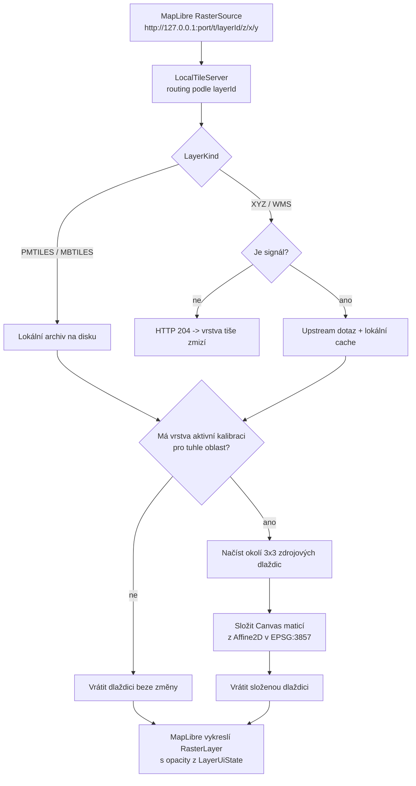
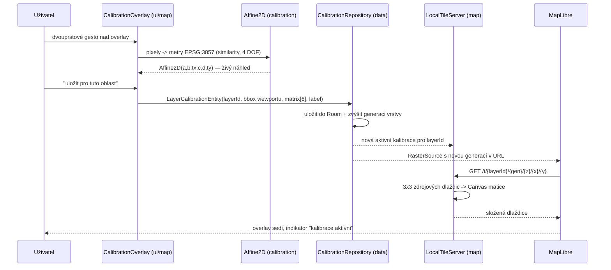

# Architektura — DetektorMapy

> Zadání projektu je `PLAN.md`, živá rozhodnutí jsou v `handoff.md`.
> Tento dokument popisuje, **jak je aplikace poskládaná** a **proč** — ne co se teprve plánuje.
> Cokoliv, co PLAN.md neurčuje, je zde označeno `TODO ověřit`.

---

## 1. Přehled v jedné větě

Offline-first Android aplikace, která nad OpenStreetMap podkladem zobrazuje historické
mapy ČR jako raster overlay, umí je v terénu ručně sladit s realitou a eviduje nálezy
a místa v lokální Room databázi. Těžká georeference se dělá na desktopu v Pythonu/GDAL,
telefon jen zobrazuje a doostřuje.

**Runtime projekce je vždy Web Mercator (EPSG:3857).** S-JTSK (EPSG:5514) existuje
výhradně v desktop pipeline pod `tools/`. V aplikaci se nikdy nereprojektuje.

---

## 2. Mapa modulů

Balíček `cz.hh.detektormapy`, struktura odpovídá PLAN.md sekci 4.

| Modul | Obsah | Zodpovědnost |
|---|---|---|
| `ui/` | Compose obrazovky, Material 3 | prezentace, žádná business logika |
| `ui/map/` | `MapScreen`, `LayerPanel`, `CalibrationOverlay` | mapa, panel vrstev, kalibrační mód |
| `ui/finds/` | `FindsList`, `FindDetail`, `FindCapture` | deník nálezů, CameraX flow |
| `ui/places/` | waypointy, plánované lokality | dlouhý stisk na mapě → místo |
| `ui/settings/` | nastavení, export/import, about | atribuce zdrojů, zálohy |
| `ui/nav/` | `AppNavHost`, `Destinations` | bottom navigation Mapa / Nálezy / Místa / Nastavení |
| `map/` | `LayerDef`/`LayerCatalog`, `LayerManager`, lokální dlaždicový server, PMTiles reader | vše kolem vrstev a dlaždic |
| `calibration/` | `Affine2D`, výpočet transformací, GCP editor | matematika sladění mapy |
| `data/` | Room entity, DAO, repository | perzistence |
| `location/` | GPS, kompas, `TrackRecordingService` | poloha a záznam pochůzky |
| `util/` | `WebMercator` a spol. | čisté funkce, plně unit-testovatelné |
| `di/` | Hilt moduly | skládání závislostí |

Mimo `app/`:

- `tools/` — desktop pipeline v Pythonu (`sources.py` jako single source of truth pro
  datové zdroje, `check_endpoints.py`, `fetch_tiles.py`, dále `build_pmtiles.py`,
  `warp_scan.py`, `dmr5g_hillshade.py` podle PLAN.md sekce 4).
- `docs/` — tento dokument, `DATA_SOURCES.md`, `FIELD_GUIDE.md`.

### Směr závislostí

```
ui  →  map / calibration / data / location  →  util
```

`ui` nikdy nesahá přímo do Room DAO ani do dlaždicového serveru — jde přes repository,
respektive přes `LayerManager`. `util` nezná nic nad sebou; proto se `WebMercator`
i `Affine2D` testují jako čistý Kotlin bez zařízení.

---

## 3. Datový tok vrstev: `layers.json` → LayerManager → dlaždicový server → MapLibre

Vrstvy jsou **data-driven** (PLAN.md sekce 4): přidání nové historické mapy = nakopírovat
`.pmtiles` soubor a přidat řádek do JSON. Žádný release aplikace.

1. **`layers.json`** leží v app storage vedle dlaždicových archivů, tedy v
   `Android/data/cz.hh.detektormapy/files/layers/` (PLAN.md sekce 7, bod 4).
   Deserializuje se přes kotlinx.serialization do `LayerCatalog` / `LayerDef`
   (`map/LayerDef.kt`). `LayerDef` nese `id`, `title`, `kind`, `source`, `attribution`,
   `defaultOpacity`, `minZoom`/`maxZoom`, `order`, `bounds`, a u WMS navíc
   `wmsLayers`/`wmsStyle`/`wmsFormat`/`wmsVersion`.
2. **`LayerKind`** rozhoduje, jak se vrstva servíruje: `PMTILES`, `MBTILES`, `VECTOR`,
   `GEOJSON`, `IMAGE` jsou lokální; `XYZ` a `WMS` jsou online a bez signálu tiše mizí.
3. **`LayerManager`** spojí katalog s uživatelským stavem (viditelnost, opacity, pořadí),
   který se drží v DataStore — nastavení tedy přežije restart. Výsledkem je `LayerUiState`,
   který navíc nese `available` / `unavailableReason` (chybějící soubor, mimo pokrytí)
   a `activeCalibrationId`.
4. **Lokální dlaždicový server** na `127.0.0.1` publikuje každou lokální vrstvu jako
   obyčejné XYZ dlaždice.
5. **MapLibre** dostane pro každou raster vrstvu `RasterSource` s URL
   `http://127.0.0.1:<port>/t/{layerId}/{z}/{x}/{y}` a `RasterLayer` s opacity
   z `LayerUiState`. Pořadí vrstev v MapLibre stylu odpovídá `order`.

Změna opacity nebo viditelnosti je čistě operace nad MapLibre vrstvou — dlaždice se
neznovunačítají. Změna kalibrace naopak vynutí nové stažení dlaždic (viz sekce 5).

---

## 4. Rozhodnutí: vestavěný lokální dlaždicový server

Tohle je **klíčové architektonické rozhodnutí projektu** (odpověď na spike F1-2,
zaznamenané v `handoff.md`) a stojí na něm celá Fáze 3.

### Problém

MapLibre GL Native pro Android:

- **nemá runtime afinní transformaci raster vrstvy** — nelze říct „posuň tuhle vrstvu
  o 12 m na východ a otoč o 0,4°" a nechat podklad stát;
- **nemá spolehlivé nativní čtení PMTiles** napříč verzemi.

Přitom PLAN.md sekce 6 požaduje přesně to první (Režim A — rychlý offset v terénu)
a sekce 2 to druhé (PMTiles jako závazný offline formát).

### Řešení

Vestavěný HTTP server na `127.0.0.1`, který:

1. čte dlaždice **přímo z lokálního `.pmtiles` archivu** vlastním Kotlin readerem
   (žádná externí závislost, žádná vazba na verzi MapLibre),
2. **za běhu aplikuje afinní kalibraci vrstvy** — výslednou dlaždici složí Canvas
   maticí ze zdrojových dlaždic v okolí 3×3,
3. MapLibre vidí naprosto obyčejný `RasterSource` s XYZ URL a nic o kalibraci netuší.

### Proč zrovna takhle

| Alternativa | Proč ne |
|---|---|
| `ImageSource` se 4 tažitelnými rohy pro všechno | funguje jen pro jeden list, ne pro dlaždicovou vrstvu přes celou ČR |
| Forknout MapLibre a přidat transformaci | údržba forku pro jednoho vývojáře je neúnosná |
| Warpovat celou vrstvu předem na desktopu při každé korekci | ničí smysl „sladit v terénu do 30 s" |
| Externí PMTiles knihovna | vazba na verzi MapLibre, kterou spike označil za nespolehlivou |

### Důsledky

- Kalibrace funguje i pro **dlaždicové** vrstvy, ne jen pro `ImageSource`.
- Celý mechanismus je lokální — **nic nejde na síť**, funguje v letadlovém režimu.
- Skládání dlaždic 3×3 Canvas maticí je **testovatelné unit testy bez zařízení**,
  což je pro jednoho vývojáře zásadní (DoD, PLAN.md sekce 11).
- Cena: složení dlaždice stojí CPU a paměť navíc; okno 3×3 je kompromis mezi pokrytím
  rotace/škálování a výkonem. Při velkém posunu (víc než jedna dlaždice) se okraje
  mohou projevit jako prázdné pásy — kalibrace je určená pro **jemné doladění**,
  ne pro posun o kilometry.
- `ImageSource` se 4 rohy zůstává jako fallback pro import jednotlivého skenu (F3-5).

### Cesta požadavku na dlaždici



---

## 5. Kalibrační pipeline

PLAN.md sekce 6 definuje dva režimy. Oba končí v jedné a téže datové struktuře.

### Režim A — rychlý offset (v terénu, cíl < 30 s)

Dvouprstové gesto v kalibračním módu hýbe **jen overlay vrstvou**, OSM podklad stojí.
Similarity transform, 4 stupně volnosti: posun X, posun Y, rotace, měřítko.

Gesto v pixelech se převede na Web Mercator metry přes `WebMercator.resolution(zoom)`
a složí do `Affine2D` — šestice `a, b, tx, c, d, ty`, ukládaná row-major jako

```
| a  b  tx |
| c  d  ty |
| 0  0   1 |
```

Transformace pracuje **v metrech EPSG:3857, nikdy v pixelech ani ve stupních** — proto
kalibrace nasnímaná na jednom zoomu platí na všech ostatních.

Tlačítko „uložit pro tuto oblast" zapíše `LayerCalibrationEntity` s bboxem aktuálního
viewportu. Při pohybu mapy se aplikuje kalibrace s nejbližším bboxem, nebo žádná —
kalibrace je tedy **per-region**: jedna mapa může mít různé korekce v různých katastrech.

### Režim B — GCP editor (doma)

Split-view stará mapa vs. ortofoto, uživatel páruje body (kostel, křižovatka, hráz).
≥ 3 body → afinní transformace metodou nejmenších čtverců, s RMSE indikátorem.
≥ 6 bodů → nabídne se TPS.

**TPS se v telefonu nepočítá do rastru.** Aplikace jen vygeneruje GCP soubor / GDAL
příkaz pro `tools/warp_scan.py` a přesný warp (`gdalwarp -tps`) proběhne na desktopu.
Aplikace TPS *připraví*, nepočítá.

### Bump generace

Kalibrace vrstvy se v serverových URL projeví přes **generaci**: každý zápis nebo změna
`LayerCalibrationEntity` zvýší číslo generace vrstvy. Generace je součástí URL
`RasterSource`, takže MapLibre považuje dlaždice za nové a nesáhne po svojí cache.
Bez toho by se posun na obrazovce neprojevil, dokud by uživatel neodjel pryč a nevrátil se.



Při návratu do oblasti se kalibrace aplikuje sama — uživatel nic nedělá.

---

## 6. Přehled Room schématu

Podle PLAN.md sekce 5. Entity v `data/`, přístup přes DAO a repository, schéma se
exportuje do `app/schemas` (`room.schemaLocation` v `app/build.gradle.kts`).

| Entita | Klíčová pole | Poznámka |
|---|---|---|
| `Find` | `id`, `lat`, `lon`, `altitude`, `createdAt`, `title`, `category`, `depthCm?`, `note`, `favorite`, `layerContextId?` | `category` = mince / knoflík / vojenské / … ; `layerContextId` = na jaké historické mapě jsem hledal (F2-6) |
| `FindPhoto` | `id`, `findId` (FK), `uri`, `createdAt` | 1–3 fotky na nález, soubory v app-specific storage |
| `Place` | `id`, `lat`, `lon`, `type`, `title`, `note`, `createdAt`, `visited` | `type` = plán / zajímavost / zákaz / sraz |
| `SearchedArea` | `id`, `name`, `polygonGeoJson`, `createdAt` | ručně kreslený polygon prohledané zóny |
| `Track` | `id`, `startedAt`, `endedAt`, `gpxPath` | záznam pochůzky (Fáze 4), GPX na disku |
| `LayerCalibration` | `id`, `layerId`, `bboxGeoJson`, `matrix[6]`, `createdAt`, `label` | `matrix[6]` je přesně šestice z `Affine2D` |

Pravidla:

- Souřadnice se v DB drží ve **WGS84** (lat/lon), protože to je to, co dává GPS a co
  potřebuje export do GeoJSON/GPX. Do EPSG:3857 se převádí až při výpočtu (`WebMercator`).
- `bboxGeoJson` u kalibrace je bbox viewportu v okamžiku uložení — na něm stojí výběr
  „nejbližší kalibrace" i CRUD ve správě kalibrací (F3-2).
- Fotky se do DB neukládají, jen jejich `uri`. Export je zip (GeoJSON + GPX + fotky).
- Migrace: baseline schéma vzniká ve Fázi 2 (F2-1), dál se přidávají číslované migrace.
  Destruktivní migrace se nepoužívají — deník nálezů je nenahraditelný.

---

## 7. Vláknová pravidla

| Kde | Vlákno | Pravidlo |
|---|---|---|
| Compose UI, MapLibre `MapView` a jeho callbacky | main | MapLibre není thread-safe; styl a vrstvy se mění výhradně z main |
| Room DAO | `Dispatchers.IO` | žádný synchronní dotaz z main; DAO vrací `Flow` nebo `suspend` |
| Lokální dlaždicový server | vlastní pool | I/O nad archivem i skládání Canvas matice běží mimo main; každý request je nezávislý |
| Čtení PMTiles / MBTiles | `Dispatchers.IO` | jen ze serverového poolu, nikdy z UI |
| Výpočty v `calibration/` a `util/` | volajícího | čisté funkce bez I/O; při gestu běží na main, protože jsou triviálně rychlé |
| GCP least squares, RMSE | `Dispatchers.Default` | CPU, ne main |
| GPS a kompas | callback vlákno → `Flow` na main | `location/`, adaptivní interval 5 s v pohybu / 30 s ve stání |
| `TrackRecordingService` | foreground service | přežívá zamčený displej, zapisuje GPX na IO |
| CameraX | vlastní executor | uložení fotky a EXIF zápis na IO |

Repository vrstva je jediné místo, kde se přepíná dispatcher. ViewModely dostávají
hotové `Flow`.

---

## 8. Offline-first pravidla

Z PLAN.md sekce 4 a sekce 11 (Definition of Done). Toto jsou tvrdá pravidla, ne doporučení.

1. **Aplikace nikdy nesmí spadnout bez signálu.** Letecký režim je součást testování
   každé feature, ne výjimka.
2. **Online zdroje jsou v panelu vrstev označené** (ikona cloudu) a **degradují tiše** —
   bez signálu vrstva zmizí, žádný dialog, žádný toast, žádná modální chyba.
3. **Žádný síťový požadavek na kritické cestě.** Zobrazení mapy, uložení nálezu,
   waypoint, záznam tracku — nic z toho se nesmí ptát sítě.
4. **Data se do repa nekomitují.** PMTiles se kopírují do
   `Android/data/cz.hh.detektormapy/files/layers/` přes USB/Syncthing (velikost + licence).
5. **Chybějící soubor není chyba.** Vrstva deklarovaná v `layers.json` bez souboru na
   disku se zobrazí jako nedostupná (`unavailableReason`), aplikace jede dál.
6. **Žádné účty, žádný sync, žádná telemetrie.** Non-goals z PLAN.md sekce 1.
7. **Baterie je feature.** Při záznamu adaptivní GPS interval a žádná síť
   (PLAN.md sekce 10) — cíl je 2 h záznamu za max 15 % baterie.

---

## Typy vrstev a proč jich je tolik

`LayerKind` v `map/LayerDef.kt` rozlišuje, odkud dlaždice přijdou. Rozdělení není
kosmetické — vychází z toho, že **runtime reprojekce je zakázaná** (PLAN.md sekce 2),
zatímco české služby jsou v S-JTSK:

| Kind | Zdroj | Kdo dělá reprojekci |
|---|---|---|
| `pmtiles` / `mbtiles` | lokální archiv v `files/layers/` | desktop pipeline (GDAL) při stahování |
| `xyz` | veřejná XYZ/WMTS šablona už ve Web Mercatoru (OSM) | nikdo, je to rovnou 3857 |
| `arcgis` | ArcGIS `MapServer/export` s `bboxSR=3857&imageSR=3857` | **server** |
| `wms` | WMS, které přijme `CRS=EPSG:3857` (ČÚZK DMR 5G) | **server** |
| `vector` | vektorové PMTiles, renderuje přímo MapLibre stylem | — |
| `geojson` | lokální GeoJSON (ÚAN), vlastní zdroj ve stylu | — |
| `image` | jeden sken se čtyřmi rohy (`ImageSource`) | uživatel prsty |

První čtyři jdou přes lokální tile server, a proto na ně jde aplikovat kalibrace.
Poslední tři se vkládají do MapLibre stylu přímo.

Vrstva `arcgis` je jediné místo, kde se reprojektuje mimo desktop pipeline, a je to
v pořádku právě proto, že matematiku nedělá aplikace — dělá ji ArcGIS server a výsledek
se cachuje na disk jako každá jiná online dlaždice.


## 9. Co ještě není rozhodnuté

- Přesný port lokálního dlaždicového serveru a jeho životní cyklus vůči Android
  procesu — `TODO ověřit` při implementaci Fáze 1.
- Endpoint ÚAN (NPÚ): PLAN.md sekce 3 ho explicitně označuje jako „ověřit aktuální
  endpoint při implementaci". V `tools/sources.py` je vedený jako `verified=False`
  s env override `DETEKTORMAPY_UAN_URL`. Viz `docs/DATA_SOURCES.md`.
- Zdroj offline OSM basemapy (Protomaps build vs. OpenFreeMap extract, F1-5) —
  `TODO ověřit`.
